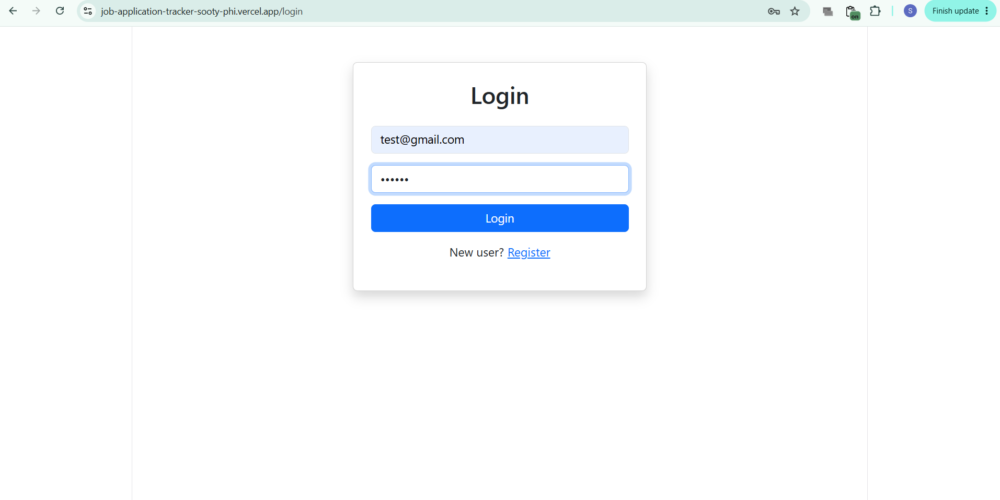
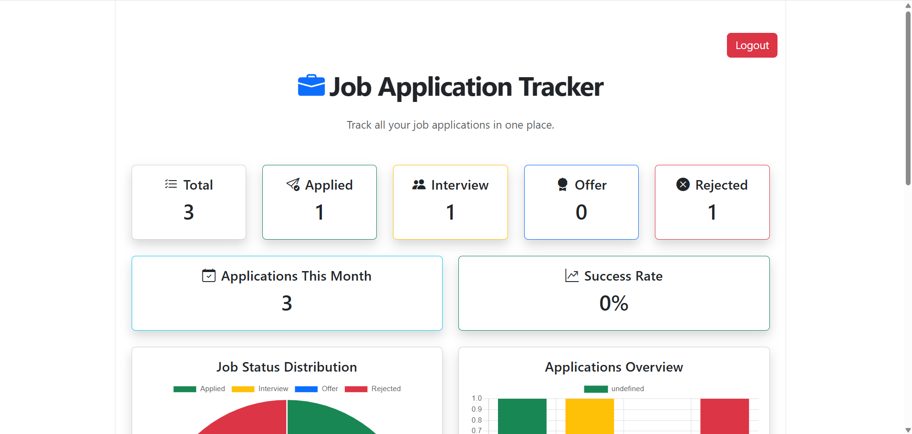
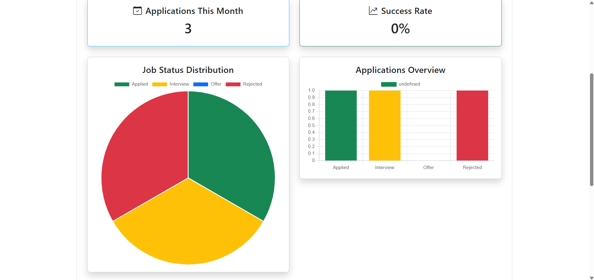
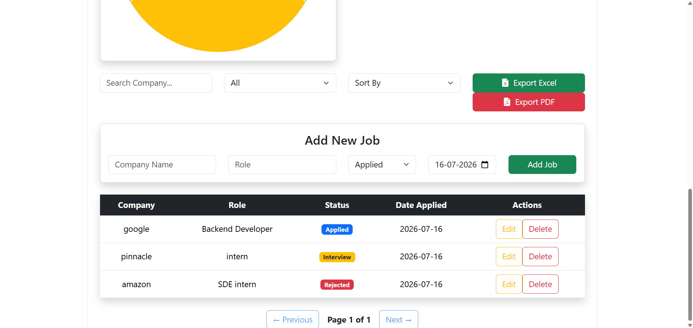

# 🚀 Job Tracker - Full Stack Job Application Management System

A production-ready **Full Stack Job Tracker** built with **Spring Boot**, **React**, **MySQL**, and **JWT Authentication**. The application helps users efficiently manage their job applications with secure authentication, personalized dashboards, analytics, search, filtering, sorting, pagination, and data export capabilities.

---

## 🌐 Live Demo

### Frontend
https://job-application-tracker-sooty-phi.vercel.app

### Backend API
https://jobtracker-backend-kjmc.onrender.com

---

# 📷 Screenshots

## Login page



---

## Dashboard



---

## Analysis



---

## features



---


# ✨ Features

## 🔐 Authentication
- Secure User Registration
- Secure Login
- JWT Authentication
- BCrypt Password Encryption
- Protected Routes
- Logout Functionality

---

## 📋 Job Management

- Add Job Applications
- Update Existing Jobs
- Delete Jobs
- View All Jobs
- Search by Company
- Filter by Status
- Sort by Company, Role and Status
- Pagination
- Date Tracking

---

## 👤 User-Specific Data

Every authenticated user can access **only their own job applications**, ensuring complete data privacy and security.

---

## 📊 Dashboard

- Interactive Status Chart
- Application Statistics
- Real-time Dashboard Updates

---

## 📄 Export

- Export Jobs to Excel
- Export Jobs to PDF

---

## 🌐 Deployment

- Frontend deployed on **Vercel**
- Backend deployed on **Render**

---

# 🛠 Tech Stack

### Frontend

- React.js
- Vite
- Axios
- Bootstrap
- React Router
- React Toastify
- SweetAlert2
- Chart.js
- jsPDF
- xlsx

---

### Backend

- Java 23
- Spring Boot
- Spring Security
- JWT Authentication
- Spring Data JPA
- Hibernate
- MySQL
- Maven

---

### Deployment

- Vercel
- Render
- GitHub

---

# 📂 Project Structure

```
JobTracker
│
├── frontend
│   ├── src
│   ├── components
│   ├── pages
│   ├── charts
│   ├── api
│   └── services
│
├── src/main
│   ├── controller
│   ├── service
│   ├── repository
│   ├── entity
│   ├── security
│   ├── config
│   └── dto
│
└── README.md
```

---

# 🔑 Authentication Flow

```
User Login
      │
      ▼
Spring Security
      │
      ▼
JWT Token Generated
      │
      ▼
Stored in Local Storage
      │
      ▼
Axios Interceptor
      │
      ▼
Authorization: Bearer <Token>
      │
      ▼
Protected REST APIs
```

---

# 🗄 Database Design

## User

| Field | Type |
|-------|------|
| id | Long |
| email | String |
| password | String |

---

## JobApplication

| Field | Type |
|-------|------|
| id | Long |
| companyName | String |
| role | String |
| status | String |
| dateApplied | LocalDate |
| user | User |

---

# ⚙️ Installation

## Clone Repository

```bash
git clone https://github.com/shivangitiwari0411/job-application-tracker
```

---

## Backend

```bash
cd jobtracker

mvn spring-boot:run
```

---

## Frontend

```bash
cd frontend

npm install

npm run dev
```

---

# 🔧 Environment Variables

## Backend

Create

```
application-local.properties
```

```
spring.datasource.url=jdbc:mysql://localhost:3306/jobtracker
spring.datasource.username=YOUR_USERNAME
spring.datasource.password=YOUR_PASSWORD

jwt.secret=YOUR_SECRET_KEY
jwt.expiration=86400000
```

---

## Frontend

Update

```
src/api/axios.js
```

For local development

```javascript
baseURL: "http://localhost:8080"
```

For production

```javascript
baseURL: "https://jobtracker-backend-kjmc.onrender.com"
```

---

# REST API Endpoints

| Method | Endpoint |
|---------|----------|
| POST | /auth/register |
| POST | /auth/login |
| GET | /jobs |
| POST | /jobs |
| PUT | /jobs/{id} |
| DELETE | /jobs/{id} |
| GET | /jobs/paged |
| GET | /jobs/sorted |

---

# Future Improvements

- Dark Mode
- Resume Upload
- Interview Reminder
- Email Notifications
- Profile Management
- Docker Support
- CI/CD Pipeline

---

# Author

**Shivangi Tiwari**

B.Tech Computer Science Engineering

VIT Bhopal University

GitHub:
https://github.com/shivangitiwari0411

LinkedIn:
https://www.linkedin.com/in/shivangi-tiwari0411/

---

# ⭐ If you like this project

Give it a ⭐ on GitHub!
